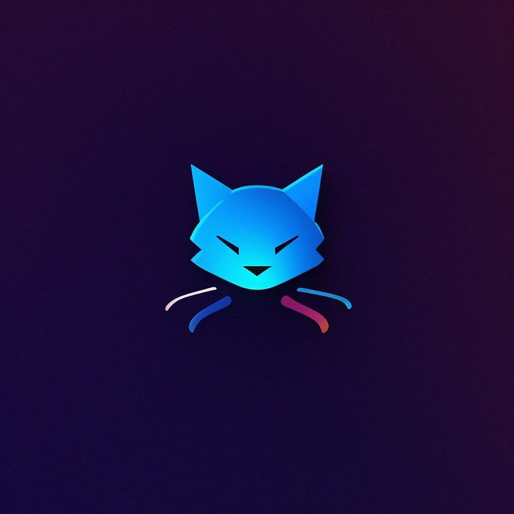

  
Привет 👋

  
  
Меня зовут Егор и это мой git

  
В настоящее время я заканчиваю учебу в ВУЗе и активно учусь Аналитике Данных

  
Вот ссылки на меня

  
  

<!--
**Patrik1352/Patrik1352** is a ✨ _special_ ✨ repository because its `README.md` (this file) appears on your GitHub profile.

Here are some ideas to get you started:

- 🔭 I’m currently working on ...
- 🌱 I’m currently learning ...
- 👯 I’m looking to collaborate on ...
- 🤔 I’m looking for help with ...
- 💬 Ask me about ...
- 📫 How to reach me: ...
- 😄 Pronouns: ...
- ⚡ Fun fact: ...
-->
